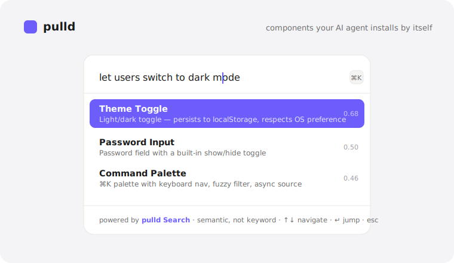

# pulld

Production-ready UI components for [shadcn/ui](https://ui.shadcn.com) — typed, accessible, and theme-aware. Install them with the shadcn CLI, or let your AI coding agent (Claude Code, Cursor, v0) add them by name.

**Browse the catalog → [pulld.pages.dev](https://pulld.pages.dev)**

## Demo



Press <kbd>⌘K</kbd> on [pulld.pages.dev](https://pulld.pages.dev) and search the components by meaning — that search is **pulld Search** (hosted semantic search) running on the page itself.

## Install

Add a component directly by URL:

```bash
npx shadcn@latest add https://pulld.pages.dev/r/copy-button.json
```

Or register the `@pulld` namespace once in your `components.json`, then install by name (the shadcn MCP can browse it too):

```json
{
  "registries": {
    "@pulld": "https://pulld.pages.dev/r/{name}.json"
  }
}
```

```bash
npx shadcn@latest add @pulld/copy-button
```

AI-readable index: [llms.txt](https://pulld.pages.dev/llms.txt).

## What you get

Every component is:

- **Typed** — full TypeScript, explicit props, no `any`.
- **Accessible** — proper ARIA, keyboard support, visible focus states.
- **Theme-aware** — uses your shadcn CSS variables, light & dark.
- **Dependency-light** — drops into any shadcn / React / Tailwind project.

Browse the full, growing catalog at [pulld.pages.dev](https://pulld.pages.dev).

## Pro blocks

Composed, opinionated blocks built from the free components (dashboards, and more). A one-time license unlocks install:

```bash
npx shadcn@latest add "https://pulld.pages.dev/r/pro/dashboard-overview.json?key=YOUR_KEY"
```

Get a license at [pulld.pages.dev](https://pulld.pages.dev).

## License

The free components are MIT-licensed. Pro blocks are covered by their purchase license.
